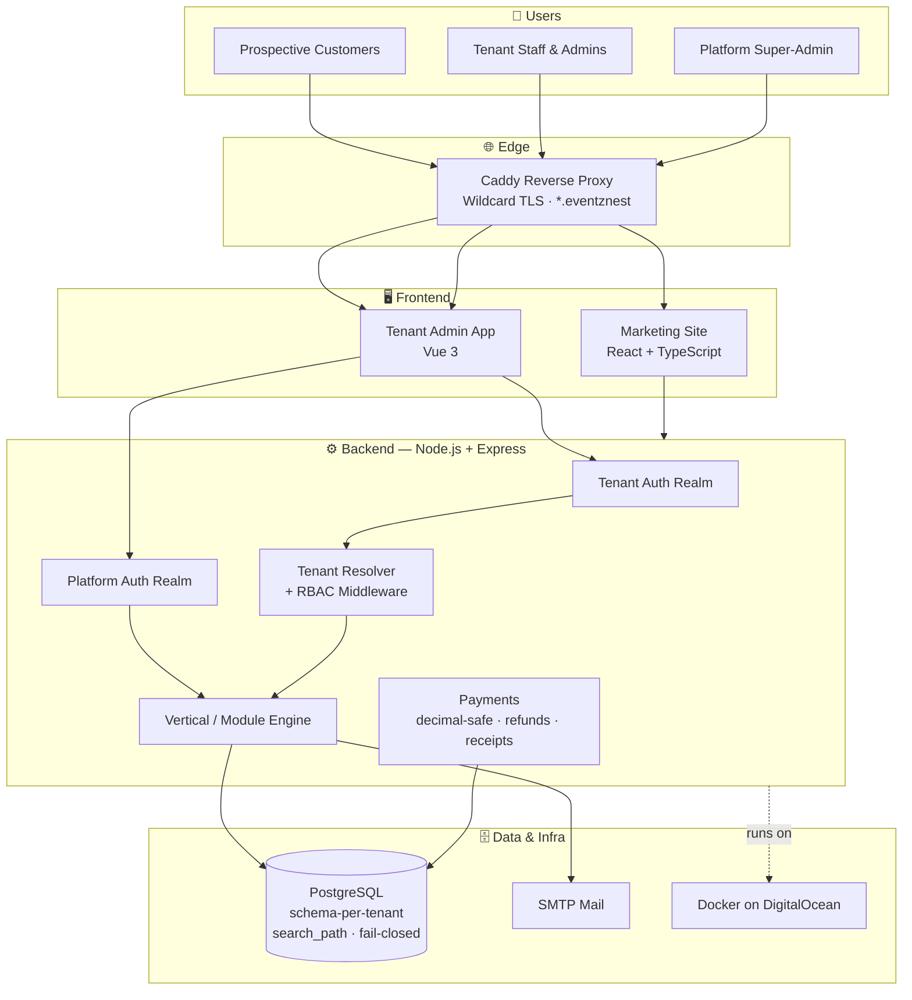

# 🎪 EventzNest

### Multi-Tenant, Multi-Vertical SaaS Platform

*One shared core. Many industries. Complete tenant isolation.*

---

> **About this repository**
> This is a **showcase / case study** of EventzNest — a SaaS platform I'm designing and building end to end as a personal project. The application source lives in a private repository; this page documents the architecture, the engineering decisions, and the hard problems I solved. It's meant to explain *how* the system works, not to ship the code.

---

## 🧭 Overview

**EventzNest** is a multi-tenant SaaS platform that serves **more than one industry from a single shared codebase**. Instead of building a separate product per industry, each customer (tenant) is provisioned onto a business-type **"vertical" template** that decides their module set and workflows — while authentication, tenant isolation, billing, and infrastructure stay as common, shared plumbing.

Two verticals run on the same core today:

| Vertical | What tenants get |
| --- | --- |
| 🍽️ **Catering** | Event bookings, quotations, receivables, and customer management |
| 🥋 **Karate Academy** | Student attendance, grading, and belt-progression tracking |

Adding a third vertical is a matter of defining a new module template — not forking the platform.

---

## ✨ Engineering Highlights

- 🏢 **True multi-tenancy with hard data isolation** — one tenant can never read another's data, enforced at the database boundary rather than trusted to application code.
- 🧩 **Vertical/module templates** — a tenant's *business type* selects its feature set at provisioning time, so one platform powers very different products.
- 🔐 **Two independent auth realms** — the tenant-facing app and the platform super-admin console authenticate separately, so a compromise in one never crosses into the other.
- 💳 **Decimal-safe money handling** — payments, refunds, and receipts use exact decimal math, never floating point.
- 🌐 **Automated tenant provisioning** — onboarding and offboarding spin tenants up and down through a repeatable workflow.
- 📣 **Public marketing site** for lead generation, separate from the authenticated product.

---

## 🏗️ Architecture

---

## 🔐 Multi-Tenancy & Security

The core design goal was **isolation you can trust**, not isolation you hope for:

- **Schema-per-tenant on PostgreSQL.** Each tenant's data lives in its own database schema. Requests are scoped by setting the connection's `search_path` to the resolved tenant, so queries physically cannot reach another tenant's tables.
- **Fail-closed by default.** If a tenant can't be resolved for a request, the system refuses rather than falling back to a shared or default context — the safe failure mode.
- **Separate auth realms.** The tenant application and the platform admin console are two distinct authentication surfaces. Super-admin credentials are never valid inside a tenant app, and vice-versa.
- **Role-based access control.** Distinct roles for tenant staff, tenant admins, and platform super-admins, each with their own permission boundaries.

---

## 🧩 The Multi-Vertical Model

Most SaaS products serve one industry. EventzNest treats the **industry itself as configuration**:

1. A tenant is created and assigned a **business type** (e.g. catering or karate academy).
2. That business type maps to a **module template** — the set of features, screens, and workflows the tenant sees.
3. Shared infrastructure (auth, isolation, billing, mail) is identical across every vertical.

The result: one platform, one deployment pipeline, and one set of security guarantees — powering products that look nothing alike to their end users.

---

## 🧠 Key Challenges & Solutions

**Guaranteeing tenants can never see each other's data.**
Filtering every query by a tenant ID in application code is fragile — one forgotten `WHERE` clause is a data breach. Instead, each tenant gets its own PostgreSQL schema, and a middleware resolves the tenant from the request and sets the connection's `search_path` before any query runs. Isolation is enforced by the database itself, and an unresolved tenant fails closed rather than leaking into a shared context.

**Running multiple industries on one codebase.**
A vertical/module engine maps each tenant's business type to a template of features and workflows at provisioning time, so catering and karate-academy tenants share the same core, deployment, and security model while seeing entirely different products.

**Keeping the admin plane separate from the tenant plane.**
The platform super-admin console and the tenant apps run as two independent authentication realms, so credentials and sessions never cross the line between *managing the platform* and *using a tenant*.

**Getting money math right.**
All financial values use exact decimal arithmetic end to end — quotations, invoices, payments, refunds, and receipts — avoiding the rounding drift that floating-point introduces.

**Per-tenant subdomains with zero-touch TLS.**
Caddy terminates HTTPS with an automatic wildcard certificate, so every tenant subdomain is served securely without any manual certificate management.

---

## 💳 Payments

Money is handled with **exact decimal arithmetic** throughout — quotations, invoices, payments, refunds, and receipts — to eliminate the rounding drift that floating-point math introduces. Refund and receipt flows are first-class, not afterthoughts.

---

## 🛠️ Tech Stack

| Layer | Technologies |
| --- | --- |
| **Frontend** | Vue 3 (tenant admin app), React + TypeScript (marketing site) |
| **Backend** | Node.js, Express |
| **Database** | PostgreSQL (schema-per-tenant isolation) |
| **Infrastructure** | Docker, DigitalOcean, Caddy (automatic wildcard TLS), SMTP |

---

## 🗺️ Roadmap

- 🌱 **More verticals** — the template model makes adding a new industry a configuration task, not a rebuild.
- 🔁 **Self-service tenant onboarding** — let new tenants provision themselves through a guided flow.
- 📊 **Per-vertical analytics & reporting** — dashboards tailored to each business type.
- 🌐 **Public live demo** — a seeded, read-only tenant to explore the product hands-on.

---

## 📄 A Note on the Source Code

The full application code is kept in a private repository. This showcase exists to demonstrate the system design, architecture decisions, and problem-solving behind EventzNest. If you'd like to discuss the implementation in more depth, I'm happy to walk through it — just reach out.

---

### 👤 Built by Shravan Kumar Nomula

Full Stack Software Engineer · Irving, TX

